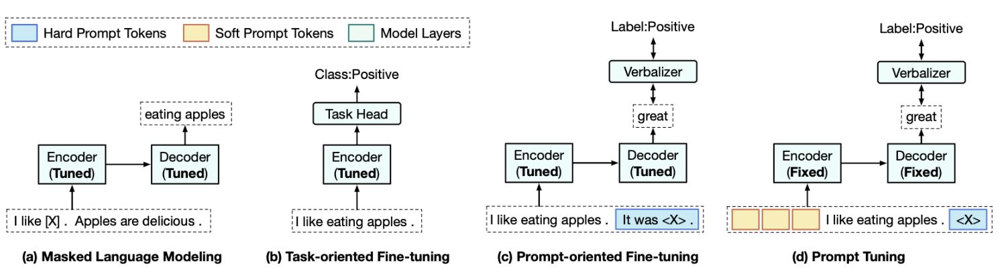
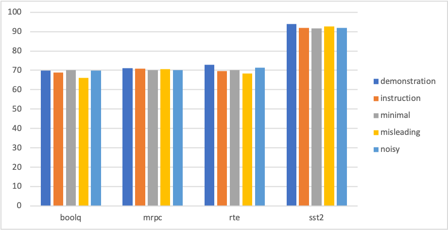
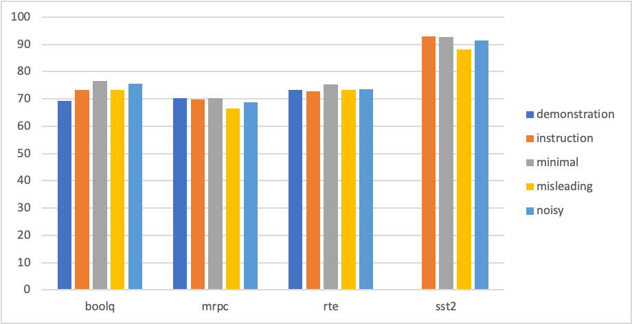
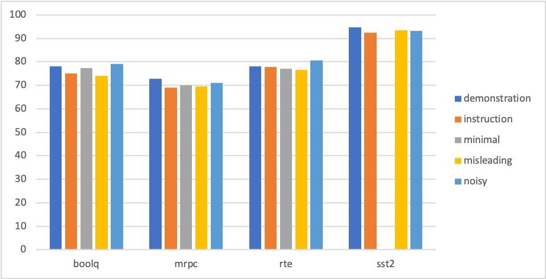

# 自然语言处理结课报告

2201787 葛源

## 项目内容

近期有许多关于**Prompt Tuning**的研究工作，也有许多研究人员认为自然语言处理领域正在从Pre-training+fine tuning范式转变为Pre-training+prompt tuning范式。这些工作更关注于如何使用Prompt Tuning使得模型取得更好的结果，如下图所示：

上图的四个模型的基础都是预训练的transformer模型。左侧两个模型属于Pre-training+fine tuning范式，其中图[a]对pre-trained Transformer的encoder与decoder微调以生成[mask]处的token；图[b]对pre-trained Transformer的encoder微调并加入一个分类层以完成分类任务。右侧两个模型属于Pre-training+prompt tuning范式，图[c]使用了 **‘[sentence] It was [mask]’** 的模版对输入做处理，再将微调后模型的输出经过verbalizer获得分类的标签；图[d]与图[c]类似，但微调的对象不再是Transformer模型，而是prompt模版最前方的一个向量。
本项目的研究工作基于图[c]的模型结构，在分类任务上**探究Prompt Tuning范式下模版(pattern)与标签词(verbalizer)对prompt性能的影响**。报告中的实验均基于小样本学习(few shot learning)，即提供32条数据作为训练集，而尽可能的用小样本数据集发挥预训练模型的性能。
早期的实验大部分基于Superglue数据集上的SST2子数据集，希望先从少量数据集上的实验现象得到初步的结论或猜想，之后再扩展到更多的数据集验证现象是否依然出现。

## 实验内容

* **pattern内容的影响**

一直以来prompt tuning存在一个问题，即prompt的性能对pattern与verbalizers十分敏感。因此有许多工作都在探索好的pattern有什么特征、如何设计更好的pattern、verbalizers如何选取等，也被称为Prompt Engineering。手工设计pattern不仅代价高昂而且效果没有保证，然而一个有趣的现象是若按照类似图[c]的模型架构，**用少量的有标注数据对预训练模型进行微调，之后pattern对prompt的性能将不再有很大的影响**。如下方的例子，在当使用以下四个手工设计的pattern时，如表1所示，tuning之前各个pattern的效果有着显著的区别，然而使用小样本微调后的区别显著减小。

    patterns = [
        ["[TEXT]", "What is this piece of news regarding? [MASK]"],
        ["[TEXT]", "What is this article about? [MASK]"],
        ["[TEXT]", "What is the best way to describe this article? [MASK]"],
        ["[TEXT]", "What is the most accurate label for this news article? [MASK]"],
    ]

| idx | before | after_tuning |
|-----|--------|--------------|
| 1   | 46.9   | [87.5, 400]  |
| 2   | 56.2   | [84.4, 600]  |
| 3   | 68.8   | [81.2, 400]  |
| 4   | 62.5   | [84.4, 200]  |

表1: 不同pattern tuning前后对比

* **pattern内顺序的影响**

接下来，已知tuning后pattern对prompt的效果影响有限，探索其他因素的影响。首先是顺序的影响，我们设计了一组实验使用以下三个pattern在不同[SENTENCE]与[MASK]顺序。可以看出pattern内各部分的顺序对prompt性能的影响并不显著，也没有明确的好坏。

    patterns = [
        ["[SENTENCE]", " It was [MASK]."],
        ['[SENTENCE]\nQuestion: Was that sentence positive or negative? ', 'Answer: [MASK] .'],
        ['Does the following sentence have a positive or negative sentiment?\n[SENTENCE]', '[MASK].'],
        ["It was [MASK] ", "[SENTENCE]."],
        [' Answer: [MASK] .', '[SENTENCE]\nQuestion: Was that sentence positive or negative?.'],
        ['[MASK]', 'Does the following sentence have a positive or negative sentiment?\n[SENTENCE]'],
    ]

| pattern_idx  | order              |  acc  |
|--------------|--------------------|-------|
| pattern_1    | [SENTENCE], [MASK] | 92.9  |
| pattern_2    | [SENTENCE], [MASK] | 90.8  |
| pattern_3    | [SENTENCE], [MASK] | 92.0  |
| pattern_1    | [MASK], [SENTENCE] | 90.9  |
| pattern_2    | [MASK], [SENTENCE] | 92.8  |
| pattern_3    | [MASK], [SENTENCE] | 91.7  |

表2: 相同pattern不同顺序

* **patter复杂内容的影响**

在接下来，我们考虑将第一部分pattern内容的影响做更进一步的分析，我们观察到的一个现象是一个复杂的pattern和一个简单的pattern在tuning后的性能表现是相近的，如以下两个pattern：

    ['[SENTENCE] Question: was that sentence positive or negative? Answer:', '[MASK]'],
    ['[SENTENCE], '[MASK]'],   

因此猜测有没有可能一个复杂的pattern其实是一个普通的pattern加上了一些无用的噪声，从而在现象上表现出复杂pattern的效果对比普通pattern相近或更差。因此这部分的实验反过来，在简单pattern的基础上，添加一些无用的噪声或者否定，观察噪声是否会造成影响、否定是否会被当作噪声等。实验的结果表明噪声对pattern几乎没有影响，但是若在pattern中加入否定将显著影响prompt的性能。

    patterns = [
        ["[SENTENCE]", " It was [MASK].", "You are a good few-shot learner, you can do it!"],
        ['[SENTENCE]\nQuestion: Was that sentence positive or negative? ', 'Answer: [MASK] .', "You are a good few-shot learner, you can do it!"],
        ["[SENTENCE]", " It was not [MASK].", ""],
        ['[SENTENCE]\nQuestion: Was that sentence positive or negative? ', 'Answer: not [MASK] .', ''],
        ["[SENTENCE]", " It was not [MASK].", "You are a good few-shot learner, you can do it!"],
        ['[SENTENCE]\nQuestion: Was that sentence positive or negative? ', 'Answer: not [MASK] .', "You are a good few-shot learner, you can do it!"],
    ]

| pattern_idx | noise | negation | acc  |
|-------------|-------|----------|------|
| baseline_1  | ---   | ---      | 92.9 |
| baseline_2  | ---   | ---      | 90.8 |
| 1           | noise | ---      | 92.9 |
| 2           | noise | ---      | 90.6 | 
| 1           | ---   | negation | 91.9 |
| 2           | ---   | negation | 82.9 |
| 1           | noise | negation | 92.0 |
| 2           | noise | negation | 86.6 |

表3: 噪声和否定对pattern的影响

## 实验结果与分析

在有了初步的实验结论与猜想后，我们对数据集的Processor进行扩充，并使用hugging face的dataset api使得扩展任务变得比较简单，并将数据集扩展到super glue数据集、glue数据集于其他数据集的一些分类任务。最终，我们在boolq、mrpc、rte、sst2四个数据集上设计了不同类型的pattern，如下以mrpc为例，pattern分为instruction、minimal、misleading、noisy和demonstration5种。其中instruction为命令式的prompt，对应近期比较有趣的instructive learning；minimal是我们设计的简单的pattern，misleading是使用pattern将输入引导到其他问题（如此任务应判断文本关系，但引导电影评论是否有相同情感），noisy设计了简单pattern加各种噪声，demonstration则是在pattern最开始加入一个样例，对应近期比较有趣的in-context learning。同时，我们使用了三个大小不同的预训练模型，从小到大分别为roberta、albert、deberta。

    patterns = [
        # instruction
        ['Sentence1: [SENTENCE1] [SEP]', 'Sentence2: [SENTENCE2]', 'Do the following two sentences mean the same thing? [MASK]. [SEP]'],
        ['Sentence1: [SENTENCE1] [SEP]', 'Sentence2: [SENTENCE2]', 'Answer: [MASK]. [SEP]'],
        ['I want to know whether the following two sentences mean the same thing. [SENTENCE1] [SEP]', ' [SENTENCE2] [SEP]', ' [MASK]'],
        # minimal
        ['[SENTENCE1] [SEP]', ' [MASK],', ' [SENTENCE2] [SEP]'],
        # misleading
        ['Are the following two movie reviews have the same emotion? [SENTENCE1] [SEP]', ' [SENTENCE2] [SEP]', ' [MASK]'],
        # noisy
        ['Can I replace the sentence [SENTENCE1]', ' with the sentence [SENTENCE2] and have it mean the same thing?', 'You are a good few-shot learner.You can do it! [MASK]. [SEP]'],
        ['Beautiful is better than ugly. Explicit is better than implicit. Simple is better than complex. [SENTENCE1] [SEP]', ' [MASK],', ' [SENTENCE2]. [SEP]'],
        ['[SENTENCE1] [SEP] @#$%^%*() ', ' [MASK],', ' [SENTENCE2] [SEP] xxxxx'],
        ['A person on a horse jumps over a broken down airplane. [SEP] Do the following two sentences mean the same thing? [SENTENCE1] [SEP]', ' [SENTENCE2] [SEP]', ' [MASK]'],
        ["that 's far too tragic to merit such superficial treatment. [SEP] It was terrible. [SEP] [SENTENCE1] [SEP]", ' [SENTENCE2] [SEP]', ' [MASK]'],
        # demonstration
        ['Do the following two sentences mean the same thing? Air Commodore Quaife said the Hornets remained on three-minute alert throughout the operation . [SEP]'
         'Air Commodore John Quaife said the security operation was unprecedented . [SEP] Answer: No'
         'Do the following two sentences mean the same thing? [SENTENCE1] [SEP]', ' [SENTENCE2] [SEP]', ' Answer: [MASK]'],
    ]

图2 roberta效果图

图3 albert效果图

图4 deberta效果图

实验结果表明，在roberta、albert、deberta上简化后的pattern（minimal）可以达到与复杂pattern（instruction）相近的结果；给pattern加入噪声并不会对性能造成显著的影响，可能模型对pattern中的其他部分更加敏感；misleading类的pattern会对模型造成干扰而变现出比较显著的下降，这些误导确实对模型起到了干扰的作用；在pattern中加入一个短小的例子（demonstration）在许多情况下能取得更好的效果，这也说明了in-context learning的有效性。
